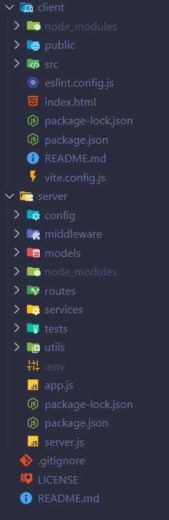
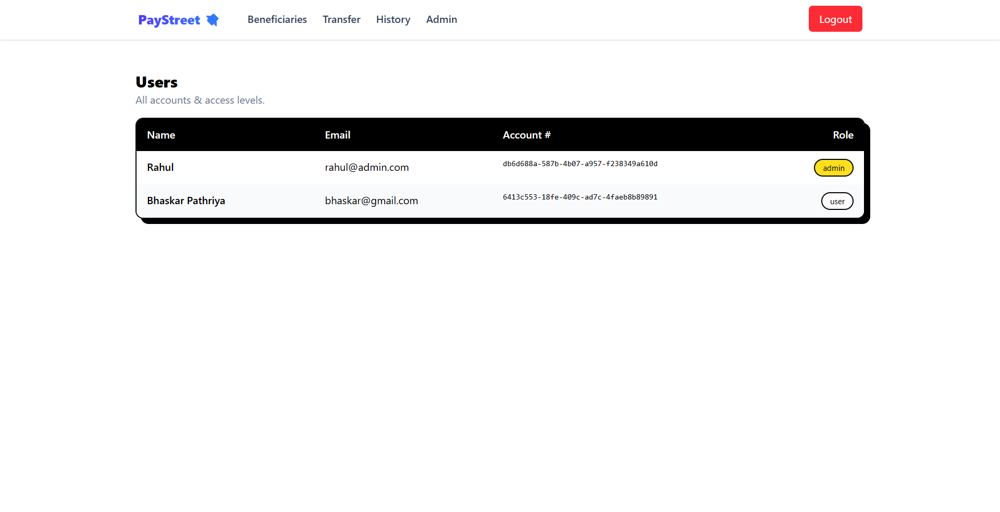
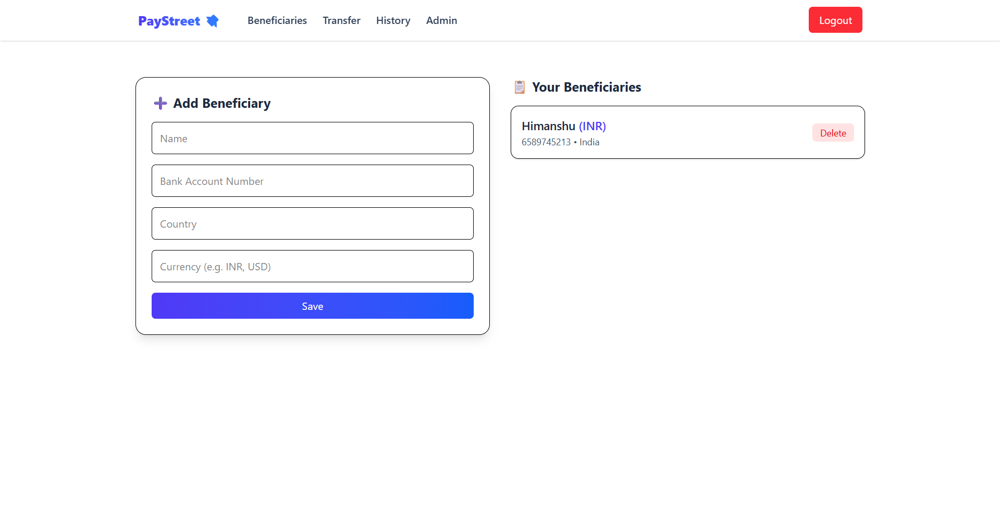
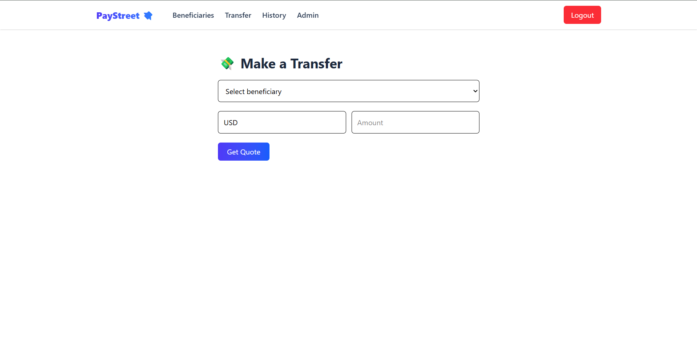
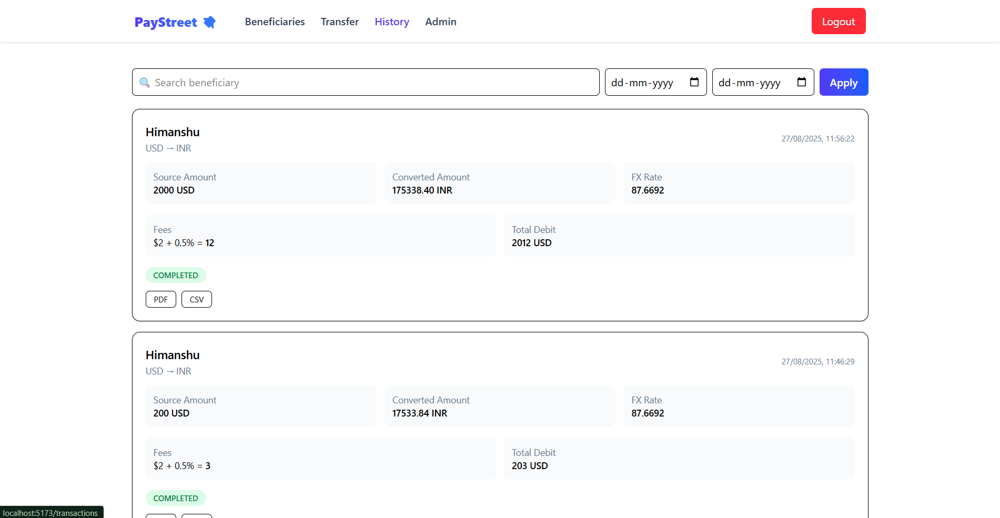
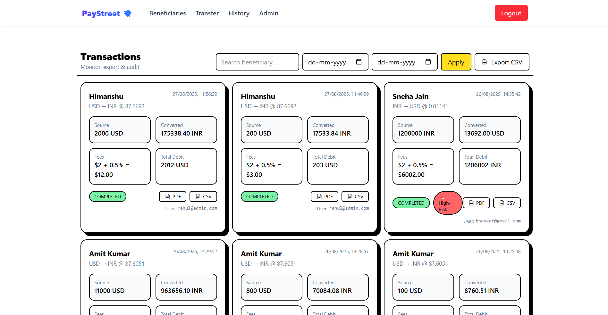
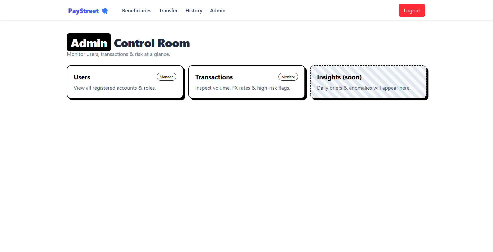

# 🌍 PayStreet — Mini Remittance Portal

A full-stack assignment project that simulates a **cross-border payments platform**.  
Frontend: **React + Vite + TailwindCSS + GSAP** • Backend: **Node.js + Express + MongoDB**

---

## 📑 Table of Contents

- [🚀 Live Demo](#-live-demo)
- [✨ Features](#-features)
- [🎁 Bonus Features](#-bonus-features)
- [🛠️ Tech Stack](#️-tech-stack)
- [📂 Project Structure](#-project-structure)
- [🧰 Setup & Run](#-setup--run)
- [🧪 Tests](#-tests)
- [🔐 Admin Access](#-admin-access)
- [📸 Screenshots](#-screenshots)
- [📡 API Endpoints (Preview)](#-api-endpoints-preview)
- [🚢 Deployment Notes](#-deployment-notes)
- [License](#license)

---

## 🚀 Live Demo

👉 **Add your deployed link here:** `https://…`  
_(Vercel/Render/Heroku are all fine.)_

---

## ✨ Features

### 1) User Onboarding & Authentication

- Signup/Login with **JWT**
- Fields: **Full Name, Email, Password**
- Account Number auto-generated (**UUID**)
- Unique email validation

### 2) Beneficiary Management

- Add / Edit / Delete beneficiaries
- Fields: **Name, Bank Account Number, Country, Currency**
- Beneficiaries scoped to the logged-in user

### 3) Money Transfer Workflow

- Select beneficiary and enter **amount** in source currency
- Live **FX conversion** to target currency
- Show **fixed + percentage** fee and **total debit**
- Confirm transaction (**mock execution**)

### 4) FX Rates Integration

- Uses **ExchangeRate API** ([v6.exchangerate-api](https://v6.exchangerate-api.com/v6))
- **15-min cache** layer to reduce calls
- Graceful **error handling** / fallbacks

### 5) Transaction History & Dashboard

- List of past transactions: **Date, Beneficiary, Amount, FX Rate, Fees, Status**
- **Filter by date** and **Search by beneficiary**

### 6) Admin Panel

- Role-based access for **Admin**
- Admin can view **all users** and **all transactions**
- Flags transactions **>$10,000** as **High-Risk**

---

## 🎁 Bonus Features

- **Receipts**: Download **PDF** & **CSV** per transaction; bulk CSV export
- **GSAP Animations**: Subtle motion for cards, lists, and modals
- **Testing** (sample): Vitest + Supertest + React Testing Library

---

## 🛠️ Tech Stack

**Frontend**

- React (Vite), TailwindCSS, GSAP, Axios

**Backend**

- Node.js, Express, MongoDB (Mongoose), JWT
- PDFKit, json2csv, qrcode (for receipts)

**Testing**

- Vitest, Supertest, React Testing Library, JSDOM

---

## 📂 Project Structure



```
paystreet-mini/
├── client/                         # React frontend
│   ├── node_modules/
│   ├── public/
│   ├── src/                        # All frontend source code
│   │   ├── pages/                  # Dashboard, Transfer, Beneficiaries, Admin
│   │   ├── components/             # Navbar, routes, shared UI
│   │   └── api/                    # Axios config, helpers
│   ├── eslint.config.js
│   ├── index.html
│   ├── package.json
│   ├── package-lock.json
│   ├── vite.config.js
│   └── README.md
│
├── server/                         # Node.js backend
│   ├── config/                     # App & DB configs
│   ├── middleware/                 # Auth, error handling
│   ├── models/                     # User, Beneficiary, Transaction
│   ├── routes/                     # Auth, Transactions, Admin, Receipts
│   ├── services/                   # FX rates, caching, business logic
│   ├── tests/                      # Unit/integration tests (sample)
│   ├── utils/                      # Utility helpers
│   ├── node_modules/
│   ├── app.js                      # Express app setup
│   ├── server.js                   # Server entry
│   ├── package.json
│   ├── package-lock.json
│   └── .env
│
├── .gitignore
└── README.md
```

---

## 🧰 Setup & Run

> **Requirements:** Node 18+, MongoDB URI, npm

### 1) Backend

```bash
cd server
npm install
cp .env.example .env   # if provided, otherwise create .env as below
npm run dev
```

Create `.env` in `/server`:

```bash
PORT=5000
MONGO_URI=<your-mongo-uri>
JWT_SECRET=<your-secret>
EXCHANGE_API_KEY=<your-api-key>
FX_BASE_URL=https://v6.exchangerate-api.com/v6
FX_CACHE_TTL_MINUTES=15
FIXED_FEE=2.00
PERCENT_FEE=0.5
# Optional: EXTERNAL_FX_BASE_URL=https://api.exchangerate.host
```

### 2) Frontend

```bash
cd client
npm install
npm run dev
```

---

## 🧪 Tests

**Backend**

```bash
cd server
npm run test
```

**Frontend**

```bash
cd client
npm run test
```

---

## 🔐 Admin Access

Use these for the admin panel:

```
Email: rahul@admin.com
Password: 12345
```

---

## 📸 Screenshots

### 🏠 User Dashboard



### ➕ Add Beneficiary



### 💸 Make a Transfer



### 📜 Transaction History



### 📂 Transaction Details



### 🔑 Admin Panel



---

## License

MIT — feel free to use and modify for learning.
